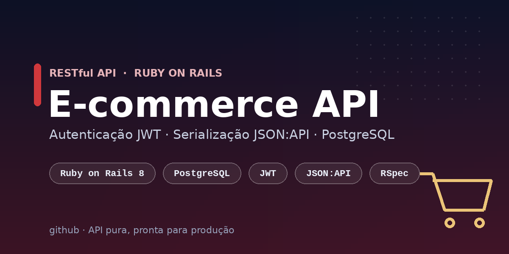

<p align="center">
  
</p>

<h1 align="center">E-commerce API · Ruby on Rails</h1>

<p align="center">
  API RESTful <strong>pura</strong> (sem views) para um e-commerce, com autenticação via <strong>JWT</strong>,
  serialização <strong>JSON:API</strong> e persistência em <strong>PostgreSQL</strong>.
</p>

<p align="center">
  <a href="https://github.com/Dudainfinity/ecommerce-api-rails/actions/workflows/ci.yml">
    
  </a>
</p>

<p align="center">
  
  
  
  
  
  
</p>

---

## Funcionalidades

- **Autenticação JWT** — registro, login e endpoint de perfil (`/me`), com senhas via `bcrypt` (`has_secure_password`).
- **Autorização por papéis** — usuários `customer` e `admin` (operações de escrita no catálogo restritas a admins).
- **Catálogo** — CRUD de **categorias** e **produtos**, com busca, filtros e paginação.
- **Pedidos** — checkout com múltiplos itens, *snapshot* de preço, baixa de estoque transacional e cancelamento com devolução ao estoque.
- **Serialização JSON:API** — respostas padronizadas com `jsonapi-serializer`.
- **CORS** configurável por variável de ambiente.
- **Testes** — 34 exemplos com RSpec (models + requests) e fábricas com FactoryBot/Faker.

## Stack

| Camada | Tecnologia |
|---|---|
| Linguagem | Ruby 3.2 |
| Framework | Rails 8.1 (modo `--api`) |
| Banco de dados | PostgreSQL 16 |
| Autenticação | JWT + bcrypt |
| Serialização | jsonapi-serializer |
| Paginação | kaminari |
| Testes | RSpec, FactoryBot, Faker |

## Modelo de dados

```
User (customer | admin)
 └─ has_many Orders
Category
 └─ has_many Products
Product  ── belongs_to Category
Order    ── belongs_to User,  has_many OrderItems
OrderItem ─ belongs_to Order, belongs_to Product
```

## Começando

### Pré-requisitos
- Ruby 3.2+
- PostgreSQL 12+
- Bundler

### Instalação

```bash
git clone https://github.com/Dudainfinity/ecommerce-api-rails.git
cd ecommerce-api-rails

bundle install

# cria o banco, roda as migrations e popula com dados de exemplo
bin/rails db:setup

# sobe a API em http://localhost:3000
bin/rails server
```

### Variáveis de ambiente

| Variável | Padrão | Descrição |
|---|---|---|
| `CORS_ORIGINS` | `*` | Origens permitidas (separadas por vírgula) |
| `RAILS_MAX_THREADS` | `5` | Tamanho do pool de conexões |

> O segredo usado para assinar os JWTs vem do `Rails.application.secret_key_base`
> (gerencie em produção via `RAILS_MASTER_KEY` / credentials).

### Usuários de exemplo (seed)

| Papel | E-mail | Senha |
|---|---|---|
| admin | `admin@example.com` | `password123` |
| customer | `cliente@example.com` | `password123` |

## Endpoints

Base: `/api/v1`

### Autenticação
| Método | Rota | Auth | Descrição |
|---|---|---|---|
| `POST` | `/auth/register` | — | Cria usuário e retorna token |
| `POST` | `/auth/login` | — | Autentica e retorna token |
| `GET`  | `/auth/me` | | Dados do usuário autenticado |

### Categorias
| Método | Rota | Auth |
|---|---|---|
| `GET` | `/categories` | — |
| `GET` | `/categories/:id` | — |
| `POST` | `/categories` | admin |
| `PATCH/PUT` | `/categories/:id` | admin |
| `DELETE` | `/categories/:id` | admin |

### Produtos
| Método | Rota | Auth | Filtros |
|---|---|---|---|
| `GET` | `/products` | — | `?q=`, `?category_id=`, `?active=true`, `?page=`, `?per_page=` |
| `GET` | `/products/:id` | — | |
| `POST` | `/products` | admin | |
| `PATCH/PUT` | `/products/:id` | admin | |
| `DELETE` | `/products/:id` | admin | |

### Pedidos
| Método | Rota | Auth | Descrição |
|---|---|---|---|
| `GET` | `/orders` | | Lista pedidos do usuário (admin vê todos) |
| `GET` | `/orders/:id` | | Detalha um pedido |
| `POST` | `/orders` | | Cria pedido a partir de itens |
| `POST` | `/orders/:id/cancel` | | Cancela e devolve o estoque |

## Documentação interativa (Swagger / OpenAPI)

A API é documentada com **OpenAPI 3.0**, gerado a partir de testes de integração
([rswag](https://github.com/rswag/rswag)) — ou seja, **a documentação é validada pelos testes** e
não fica desatualizada (há inclusive um job de CI que falha se o `swagger/v1/swagger.yaml`
estiver fora de sincronia).

- **Swagger UI:** suba o servidor e acesse **http://localhost:3000/api-docs**
- **Spec OpenAPI:** [`swagger/v1/swagger.yaml`](swagger/v1/swagger.yaml)

Na UI dá para autenticar clicando em **Authorize** e colando o token JWT (sem o prefixo `Bearer`)
retornado por `/auth/login`, e então testar todos os endpoints direto do navegador.

Para regenerar a spec após alterar os endpoints:

```bash
bundle exec rake rswag:specs:swaggerize
```

## Exemplos (cURL)

**Registrar e obter token**
```bash
curl -X POST http://localhost:3000/api/v1/auth/register \
  -H "Content-Type: application/json" \
  -d '{"name":"Maria","email":"maria@example.com","password":"password123"}'
```

**Login**
```bash
TOKEN=$(curl -s -X POST http://localhost:3000/api/v1/auth/login \
  -H "Content-Type: application/json" \
  -d '{"email":"cliente@example.com","password":"password123"}' | jq -r .token)
```

**Listar produtos (público)**
```bash
curl "http://localhost:3000/api/v1/products?q=notebook&per_page=10"
```

**Criar um pedido**
```bash
curl -X POST http://localhost:3000/api/v1/orders \
  -H "Authorization: Bearer $TOKEN" \
  -H "Content-Type: application/json" \
  -d '{"items":[{"product_id":1,"quantity":2},{"product_id":4,"quantity":1}]}'
```

## Testes

```bash
bundle exec rspec
```

```
54 examples, 0 failures
```

Inclui specs de modelo, specs de request e specs de documentação (rswag), além de
RuboCop e Brakeman rodando no CI.

## Estrutura

```
app/
├─ controllers/api/v1/   # autenticação, categorias, produtos, pedidos
├─ models/               # User, Category, Product, Order, OrderItem
├─ serializers/          # serializers JSON:API
└─ services/             # JsonWebToken (codifica/decodifica)
config/
├─ routes.rb             # namespace api/v1 + montagem do Swagger UI
└─ initializers/         # cors, rswag_api, rswag_ui
spec/
├─ models/               # testes de modelo
├─ requests/api/v1/      # testes de request + docs/ (specs OpenAPI)
└─ swagger_helper.rb     # metadados da spec OpenAPI
swagger/v1/swagger.yaml  # spec OpenAPI 3.0 gerada
```

## Licença

Distribuído sob a licença MIT. Veja [`LICENSE`](LICENSE).
